# 🚀 Three-Tier CRUD Application on AWS EC2


---

## 📌 Project Overview

A **production-style Three-Tier CRUD Web Application** deployed on **AWS EC2**.
This project demonstrates real-world cloud deployment skills including server
configuration, process management, and full-stack application deployment on AWS.

> 💡 Built as part of my DevOps learning journey under the guidance of
> **[Awais Latif](https://www.linkedin.com/in/awais-latif)** — Senior DevOps Engineer

---

## 🏗️ Architecture

```
                    ┌─────────────────────┐
                    │      Browser        │
                    └──────────┬──────────┘
                               │
                    ┌──────────▼──────────┐
                    │   EC2 Public IP     │
                    │   Ubuntu Server     │
                    └──────────┬──────────┘
                               │
               ┌───────────────┼───────────────┐
               │                               │
   ┌───────────▼───────────┐   ┌───────────────▼──────────┐
   │  TIER 1 — Frontend    │   │   TIER 2 — Backend       │
   │  React.js + Vite      │   │   Node.js + Express      │
   │  Port: 5000           │◄──│   Port: 3000             │
   │  Managed by PM2       │   │   Managed by PM2         │
   └───────────────────────┘   └───────────────┬──────────┘
                                               │
                               ┌───────────────▼──────────┐
                               │   TIER 3 — Database      │
                               │   MySQL                  │
                               │   Port: 3306             │
                               └──────────────────────────┘
```
## 🚀 Deployment Journey

### Phase 1 — PM2 Deployment
```
Code → EC2 → PM2 → App Running
GitHub Actions → Self-Hosted Runner → PM2 Restart
```

### Phase 2 — Docker Deployment
```
Code → EC2 → Docker Containers → App Running
GitHub Actions → Self-Hosted Runner → Docker Build & Run
```
---

## 🔄 CI/CD Pipeline

```
Developer pushes code to GitHub
            ↓
GitHub Actions workflow triggers
            ↓
Self-Hosted Runner on EC2 picks up job
            ↓
Phase 1: PM2 restart होता था
Phase 2: Docker containers rebuild होتے ہیں
            ↓
App automatically deployed! ✅
```

| ✅ PM2 Deploy Success | ✅ Docker Deploy Success |
|----------------------|------------------------|
| 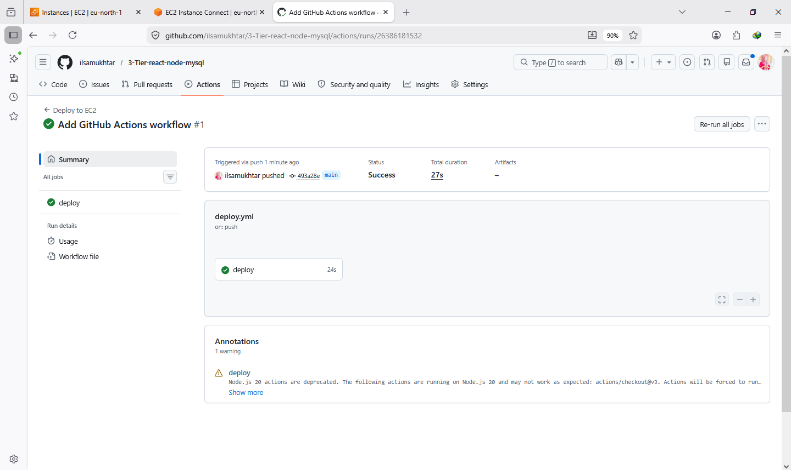 | 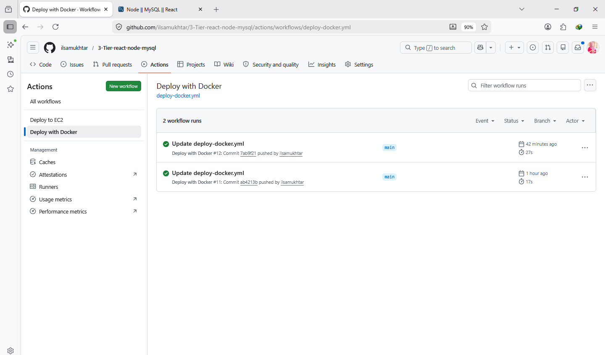 |

---


---

## ✨ Features

- ➕ **Create** — Add new user records
- 👁️ **Read** — View all users in a table
- ✏️ **Update** — Edit existing user details
- 🗑️ **Delete** — Remove user records
- 🔄 **REST API** — Clean API endpoints
- ☁️ **Cloud Deployed** — Live on AWS EC2
- 🤖 **Auto Deploy** — GitHub Actions CI/CD
- 🐳 **Dockerized** — Frontend & Backend in separate containers
---

## 🛠️ Tech Stack

| Layer | Technology | Purpose |
|-------|-----------|---------|
| 🖥️ Frontend | React.js + Vite + Axios | User Interface |
| ⚙️ Backend | Node.js + Express + Sequelize | REST API |
| 🗄️ Database | MySQL | Data Storage |
| 🔄 Process Manager | PM2 | Phase 1 Deployment |
| 🐳 Containers | Docker | Phase 2 Deployment |
| ☁️ Cloud Server | AWS EC2 (Ubuntu) | Hosting |
| 🔒 Security | AWS Security Groups | Port Management |
| 🤖 CI/CD | GitHub Actions + Self-Hosted Runner | Auto Deployment |
| 📦 Version Control | Git + GitHub | Source Code |

---

## ☁️ AWS Services Used

| Service | Usage |
|---------|-------|
| EC2 | Ubuntu server to host the app |
| Security Groups | Open ports 3000 and 5000 |

---

## 📋 Prerequisites

Before you begin, make sure you have:

- ✅ AWS EC2 Ubuntu instance running
- ✅ Node.js v18+
- ✅ MySQL installed
- ✅ PM2 installed globally
- ✅ Docker installed
- ✅ Git installed

---

## 🚀🚀  Deployment Steps

### Step 1 — Clone Repository
```bash
git clone https://github.com/ilsamukhtar/3tier-react-node-mysql.git
cd 3tier-react-node-mysql
```

### Step 2 — MySQL Database Setup
```bash
sudo mysql
```
```sql
CREATE DATABASE crud_operations;
CREATE USER 'cruduser'@'localhost' IDENTIFIED BY 'Password@123';
GRANT ALL PRIVILEGES ON crud_operations.* TO 'cruduser'@'localhost';
FLUSH PRIVILEGES;
EXIT;
```

### Step 3 — Backend Setup
```bash
# Go to backend folder
cd backend

# Install dependencies
npm install

# Create environment file
cp .env.example .env
nano .env
```
Add these values in `.env`:
```env
DB_HOST=localhost
DB_USER=cruduser
DB_PASSWORD=Password@123
DB_DATABASE=crud_operations
```
```bash
# Start backend with PM2
pm2 start index.js --name api-server --watch --env PORT=3000

# Check status
pm2 status
```

### Step 4 — Frontend Setup
```bash
# Go to frontend folder
cd ../frontend

# Install dependencies
npm install

# Create environment file
cp .env.example .env
nano .env
```
Add this value in `.env`:
```env
VITE_API_URL=http://YOUR_EC2_PUBLIC_IP:3000
```
```bash
# Start frontend with PM2
pm2 start npm --name "react-app" -- run dev -- --host 0.0.0.0

# Check status
pm2 status
```

### Step 5 — AWS Security Group
```
AWS Console → EC2 → Security Groups → Inbound Rules → Add:
✅ Port 3000 — Backend API
✅ Port 5000 — Frontend App
Source: 0.0.0.0/0
```
## 🚀 Phase 1 — PM2 Deployment Steps

### Step 1 — Clone Repository
```bash
git clone https://github.com/ilsamukhtar/3-Tier-react-node-mysql.git
cd 3-Tier-react-node-mysql
```

### Step 2 — MySQL Database Setup
```bash
sudo mysql
```
```sql
CREATE DATABASE crud_operations;
CREATE USER 'cruduser'@'localhost' IDENTIFIED BY 'Password@123';
GRANT ALL PRIVILEGES ON crud_operations.* TO 'cruduser'@'localhost';
FLUSH PRIVILEGES;
EXIT;
```

### Step 3 — Backend Setup
```bash
cd backend
npm install
cp .env.example .env
nano .env
```
```env
DB_HOST=localhost
DB_USER=cruduser
DB_PASSWORD=Password@123
DB_DATABASE=crud_operations
```
```bash
pm2 start index.js --name api-server --watch --env PORT=3000
pm2 status
```

### Step 4 — Frontend Setup
```bash
cd ../frontend
npm install
cp .env.example .env
nano .env
```
```env
VITE_API_URL=http://YOUR_EC2_PUBLIC_IP:3000
```
```bash
pm2 start npm --name "react-app" -- run dev -- --host 0.0.0.0
pm2 status
```

### Step 5 — AWS Security Group
```
Port 3000 → Backend API
Port 5000 → Frontend App
Source: 0.0.0.0/0
```

---

## 🐳 Phase 2 — Docker Deployment Steps

### Step 1 — Backend Dockerfile
```dockerfile
FROM node:18-alpine
WORKDIR /app
COPY package*.json ./
RUN npm install
COPY . .
EXPOSE 3000
CMD ["node", "index.js"]
```

### Step 2 — Frontend Dockerfile
```dockerfile
FROM node:18-alpine
WORKDIR /app
COPY package*.json ./
RUN npm install
COPY . .
EXPOSE 5000
CMD ["npm", "run", "dev", "--", "--host", "0.0.0.0"]
```

### Step 3 — MySQL Setup for Docker
```bash
sudo mysql
```
```sql
CREATE USER 'cruduser'@'%' IDENTIFIED BY 'Password@123';
GRANT ALL PRIVILEGES ON crud_operations.* TO 'cruduser'@'%';
FLUSH PRIVILEGES;
EXIT;
```

### Step 4 — Backend .env for Docker
```env
DB_HOST=172.17.0.1
DB_USER=cruduser
DB_PASSWORD=Password@123
DB_DATABASE=crud_operations
```

### Step 5 — Build & Run Containers
```bash
# Backend
docker build -t backend-app ./backend
docker run -d --name backend-container -p 3000:3000 --env-file backend/.env backend-app

# Frontend
docker build -t frontend-app ./frontend
docker run -d --name frontend-container -p 5000:5000 frontend-app

# Check
docker ps
```

---

## 🤖 GitHub Actions Self-Hosted Runner Setup

```bash
mkdir actions-runner && cd actions-runner

curl -o actions-runner-linux-x64-2.334.0.tar.gz -L \
https://github.com/actions/runner/releases/download/v2.334.0/actions-runner-linux-x64-2.334.0.tar.gz

tar xzf ./actions-runner-linux-x64-2.334.0.tar.gz

./config.sh --url https://github.com/YOUR_USERNAME/YOUR_REPO --token YOUR_TOKEN

# Install as service
sudo ./svc.sh install
sudo ./svc.sh start
```

### Step 7 — Access Application
```
🌐 Frontend : http://YOUR_EC2_IP:5000
🔌 Backend  : http://YOUR_EC2_IP:3000
```

## 📸 Screenshots

### 🖥️ Frontend UI
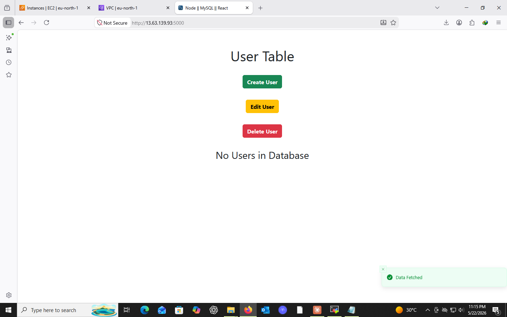

### ➕ Add User
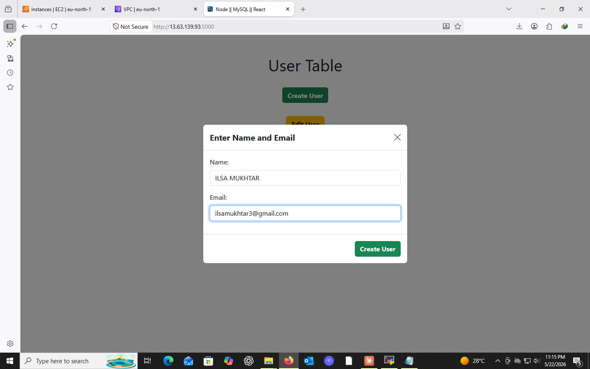

### ✏️ Edit User
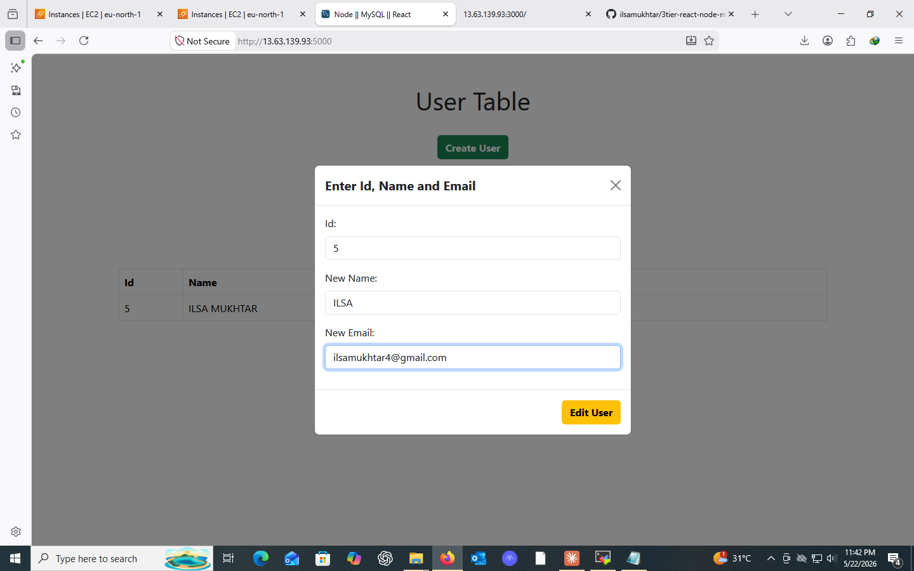

### 🗑️ Delete User
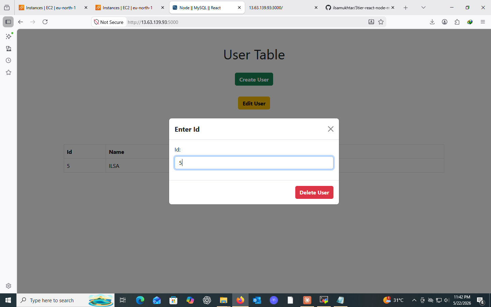

### 📋 User List
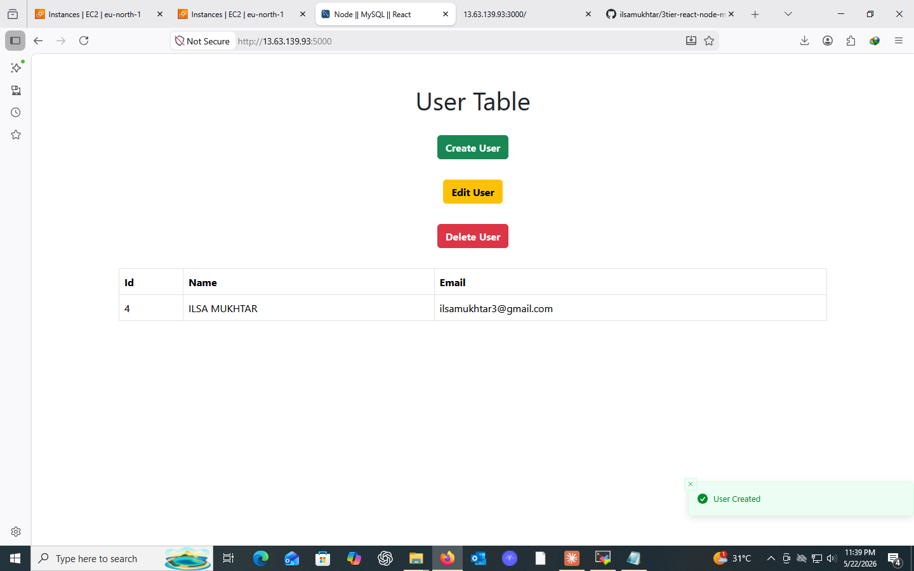

### ⚙️ Backend API
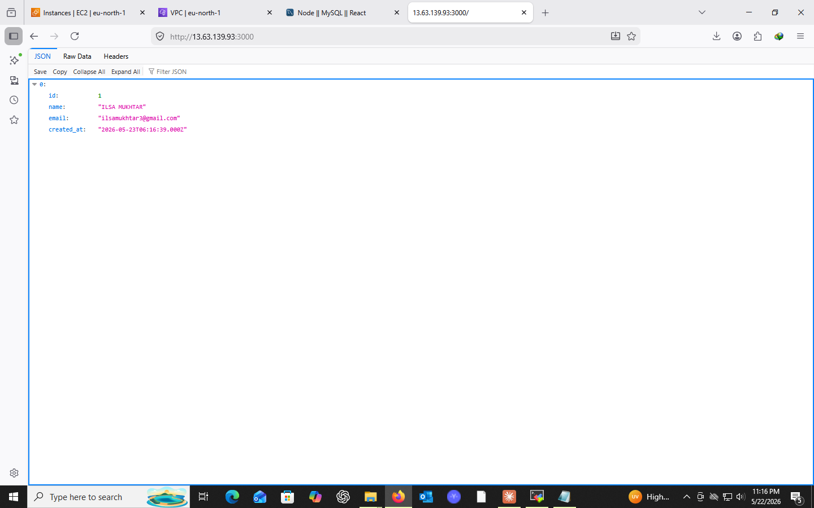

### 📡 PM2 Status
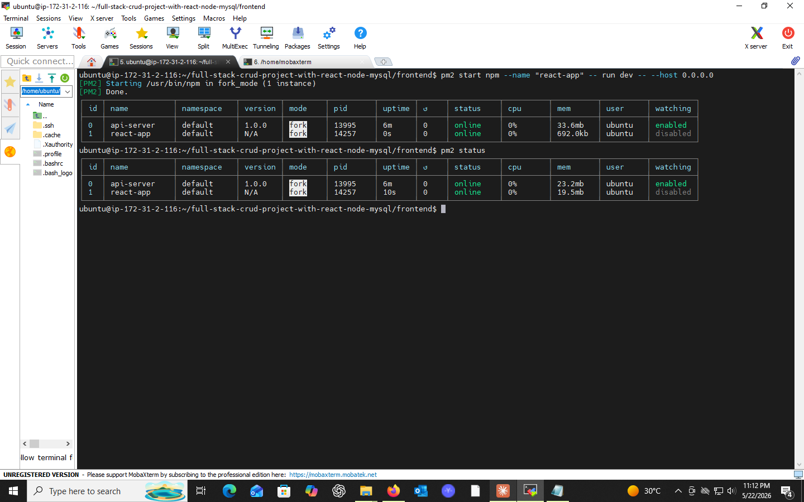

### 🐳 Docker Containers Running
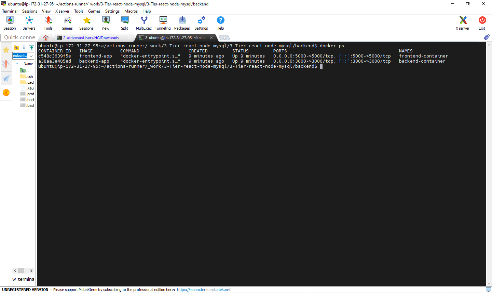

### ☁️ AWS EC2 Instance
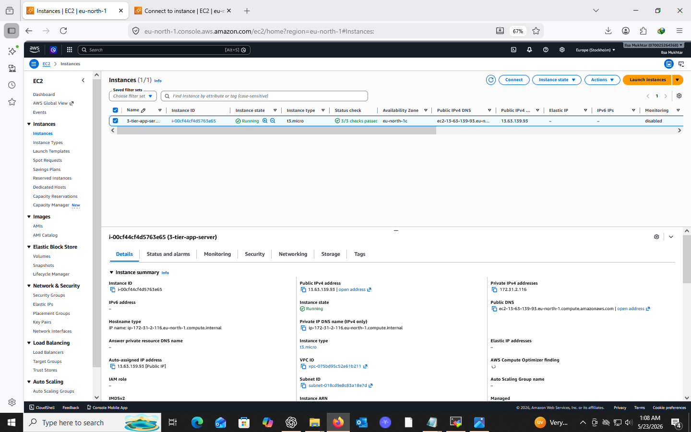

### 🔐 Security Group
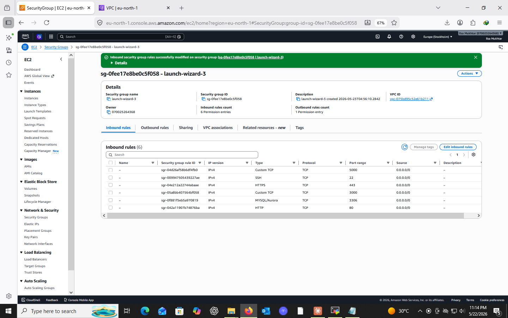

### 🔄 GitHub Actions — PM2 Deploy


### 🐳 GitHub Actions — Docker Deploy


### 🏗️ Architecture Diagram
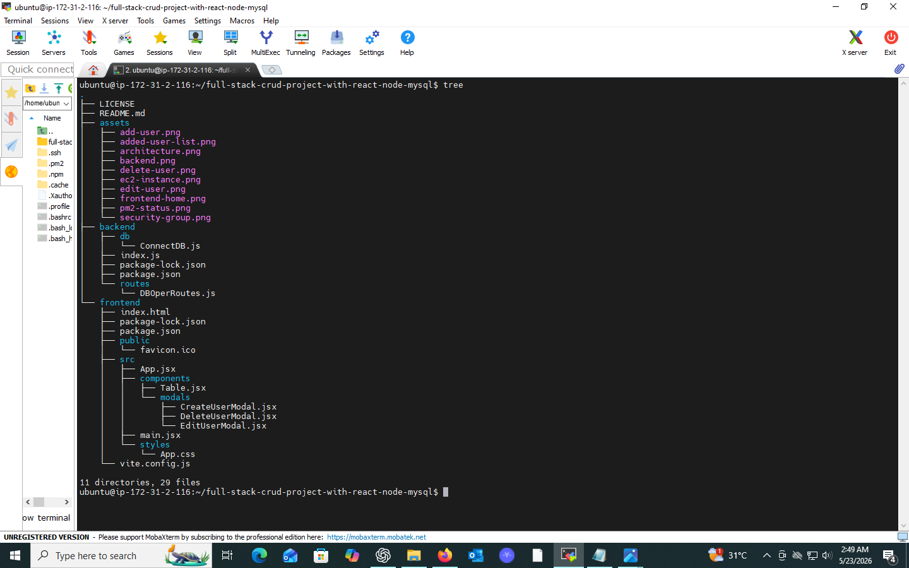

---


## 📚 What I Learned

```
✅ AWS EC2 instance setup and configuration
✅ MySQL database setup on Linux server
✅ Node.js process management with PM2
✅ React + Node.js full-stack deployment
✅ AWS Security Groups and port management
✅ Environment variables configuration
✅ End-to-end 3-tier architecture deployment
✅ GitHub Actions CI/CD pipeline setup
✅ Self-hosted runner configuration on EC2
✅ Automated deployment on every code push
✅ Docker containerization of frontend & backend
✅ Running separate containers for each tier
✅ Docker networking with local MySQL
```
---

## 🗂️ Workflow Files

| File | Purpose |
|------|---------|
| `deploy.yml` | Phase 1 — PM2 deployment |
| `deploy-docker.yml` | Phase 2 — Docker deployment |

---

---

##  Credits & Acknowledgements

| Role | Person |
|------|--------|
| 🎯 Project Guided by | **[Awais Latif](https://www.linkedin.com/in/m-awais-latif)** — Senior DevOps Engineer |
| 📦 Original Project | **[Mahadi Hassan Razib](https://github.com/mahadihassanrazib)** |

---

## 👩‍💻 Author

** ILSA MUKHTAR  **

[](https://linkedin.com/in/ilsa-mukhtar)
[](https://github.com/ilsamukhtar)

---

## 📄 License

This project is licensed under the **MIT License** — see the
[LICENSE](LICENSE) file for details.

---

<div align="center">

### ⭐ If you found this helpful, please star this repo!!!! ⭐


</div>
